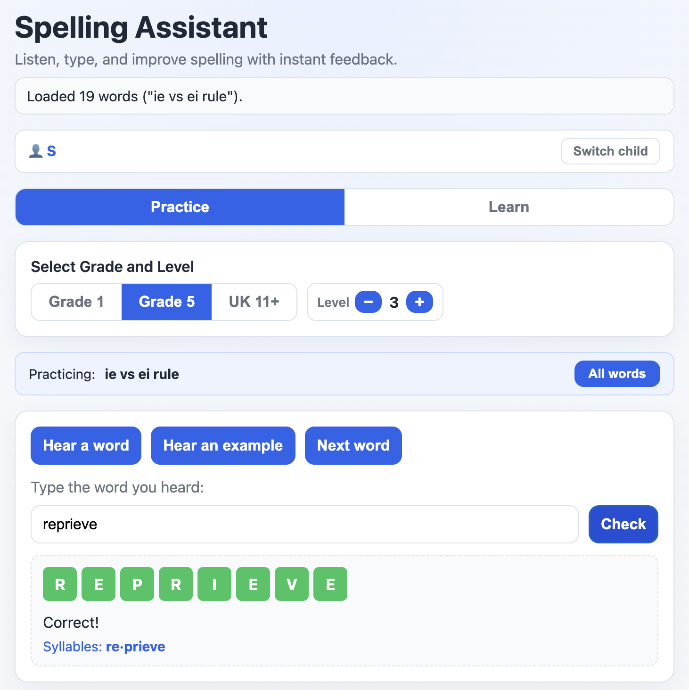
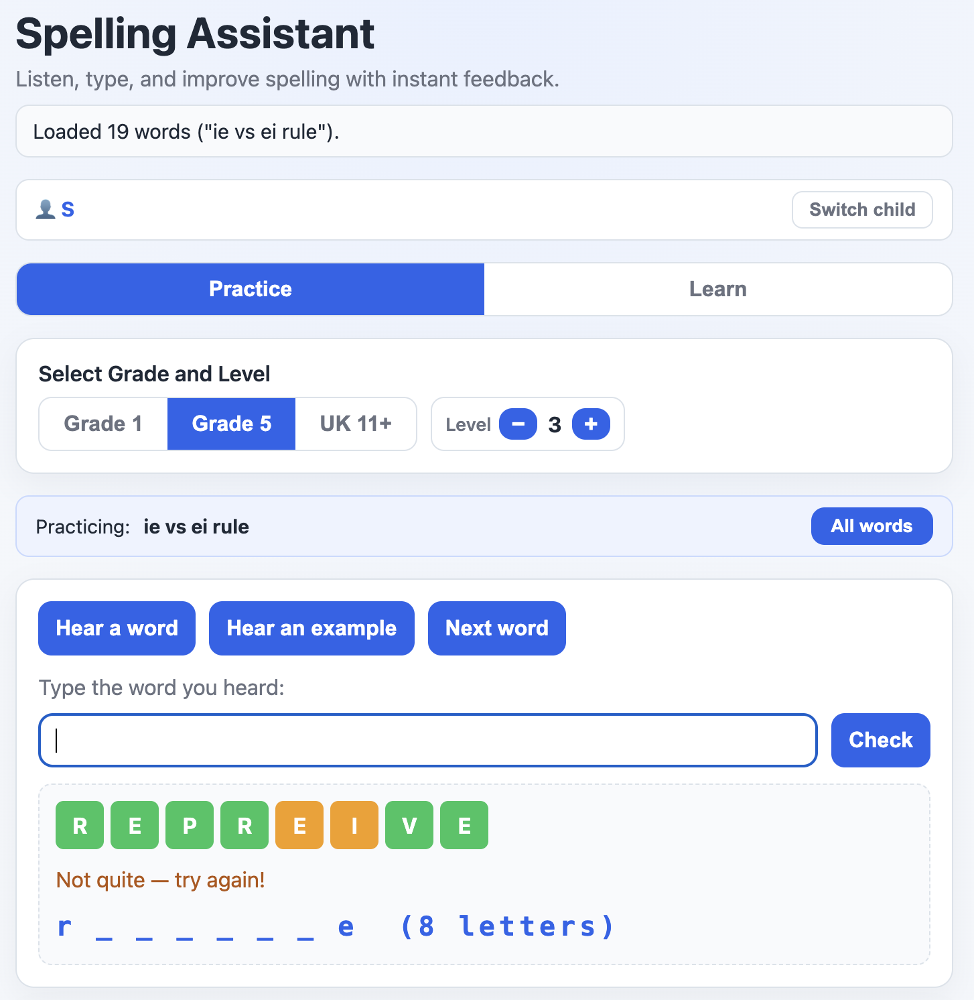
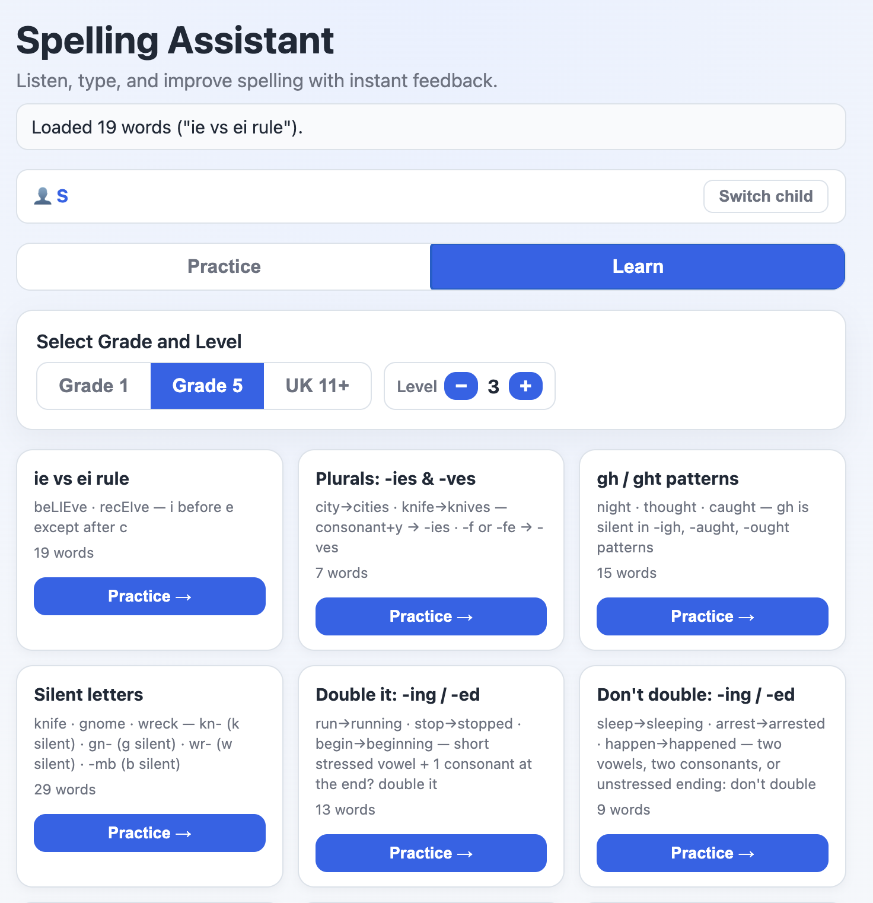
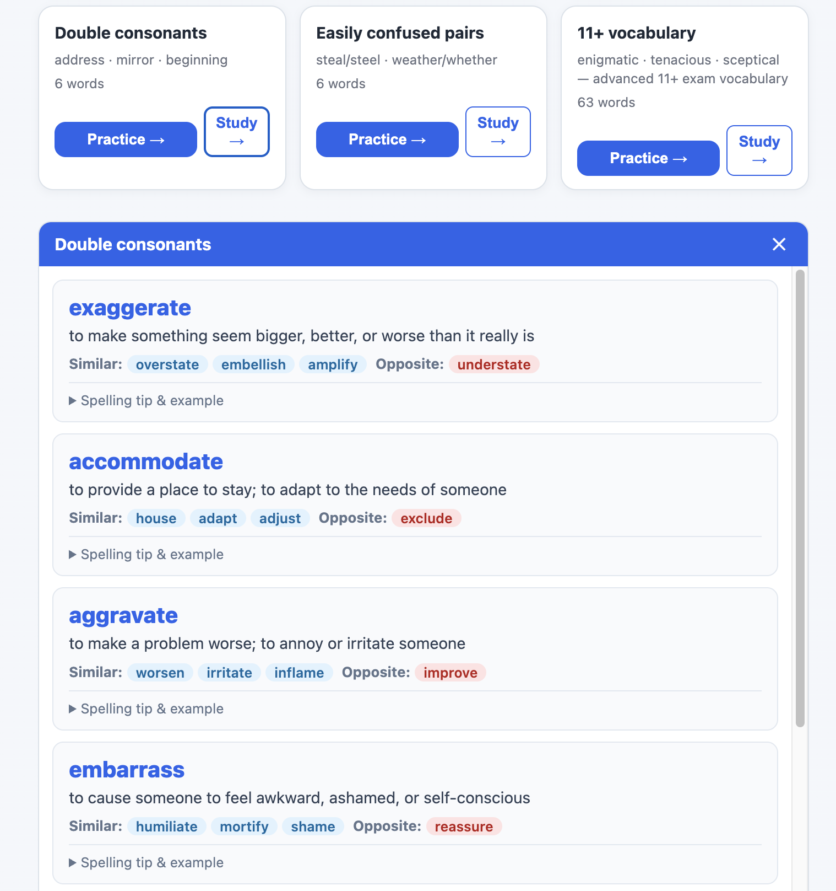

# Kids Spelling Assistant

**Live demo:** https://subashini7.github.io/kids-spelling-assistant/

A Progressive Web App (PWA) for kids' spelling practice with audio, instant feedback, automatic mastery tracking, and a structured word bank across three grade levels.

| Correct answer | Wrong answer & hint | Learn tab | Study panel |
|:-:|:-:|:-:|:-:|
|  |  |  |  |

## Features

### Child profiles

When the app first opens a name picker appears. Select an existing name or type a new one. Each child's progress (mastered words, session history, lifetime streaks) is stored separately under their name. Up to ten profiles are remembered. A **Switch child** button in the top bar lets you change profile at any time.

Mastered words are also synced to Firebase Firestore so progress is preserved across devices for the same child name.

### Practice tab

- **Select Grade and Level** — choose Grade 1, Grade 5, or UK 11+; words load automatically when the grade or level changes (no Start button needed)
- **Difficulty selector** (levels 1–5) to control word complexity
- **Hear a word** — reads the word aloud at a slow pace
- **Hear an example** — reads the sample sentence aloud
- **Next word** — picks the next word (spaced repetition aware; see below)
- Type the spelling and press **Enter** (or click **Check**) for instant feedback

#### Wordle-style letter feedback

After every submission, each typed letter appears as a coloured tile:

| Colour | Meaning |
|--------|---------|
| Green | Correct letter, correct position |
| Yellow | Letter is in the word but wrong position |
| Grey | Letter not in the word |
| Red | Extra letters beyond the word length |


#### Guided retry

On the **first** wrong attempt the input clears and a masked hint appears (first and last letter revealed, e.g. `b _ _ _ _ _ _ _ g  (9 letters)`).

 The child gets one more try before the answer is revealed. Only the original error is recorded — the child is never penalised twice for the same word.

#### Syllable breakdown

After every correct answer or final reveal, the word is shown split into syllables (e.g. `be·gin·ning`) to reinforce the sound-to-spelling connection.

#### Mastery tracking (automatic)

Every correct or wrong answer updates a per-word lifetime record stored in `localStorage`. A word is **mastered** when it is spelled correctly **3 times in a row**:

- The word is removed from the practice pool immediately — mid-session if needed
- The output shows `"running" mastered — won't appear again!`
- Mastered words stay excluded on every future session
- Mastered words are synced to Firestore so they persist across devices

#### Spaced repetition

After every answer the word is scheduled for one review before it can be mastered:

| Result | Review interval |
|--------|----------------|
| Wrong | After 2 words |
| Correct (first attempt) | After 10 words |
| Correct (after guided retry) | After 3 words |

When the review comes due it takes priority over the normal weighted-random pick. A second consecutive correct answer at that point marks the word as mastered.

#### Daily Summary

The **Show Summary** button displays:
- Total mastered words (all time) and a note that they are excluded
- Words answered perfectly today (no errors this session)
- Words still needing practice, with error count and accuracy %
- Most common error types

The summary clears automatically when **Next word** is clicked so previous answers don't distract during practice.

### Learn tab


Browse spelling patterns and rules by grade. The Learn tab is available at any time — switching to it hides the practice controls, and switching back restores them.

Each category card shows:
- The rule name and a short pattern hint (e.g. *silent e at the end makes the vowel say its name*)
- Word count for the category

Click **Practice →** on any card to jump straight to the Practice tab filtered to that category. A blue filter bar shows the active category; click **All words** to return to difficulty-level mode.

Every card also has a **Study →** button that opens a study panel for all words in the category:
- **Grade 1 & 5** — shows phonic pattern, common mistake to watch out for, memory tip, and example sentence
- **UK 11+** — shows full definition, synonyms, antonym, spelling tip, and example sentence


#### Grade 1 categories (23)

Short vowels (a/e/i/o/u) · Long 'a' silent-e / ai / ay · Long 'e' ee / ea · Long 'i' silent-e / ie / y-ending · Long 'o' silent-e / oa · oo sound · ou sound · ow sound · th words · wh words · Blends · r-vowels · Sight words

#### Grade 5 categories (18)

ie vs ei rule · Plurals -ies & -ves · gh/ght patterns · Silent letters · **Double it** (-ing/-ed) · **Don't double** (-ing/-ed) · -tion/-sion · -ous/-ious · -ness/-ment/-less · **Suffix -ful** · Prefixes · Soft c & g · Double consonants · Vowel teams · ch/ph/tch · Homophones · Math & science · General spelling

#### UK 11+ categories (15)

Character & personality · Emotions & feelings · Precise verbs · Setting & atmosphere · Abstract nouns · Latin & Greek roots · -ance/-ence endings · -able/-ible endings · -ous/-ious · -tion/-sion · Advanced prefixes · Silent letters · Double consonants · Homophones · 11+ vocabulary

## Word bank

1,014 words across three grades.

| Grade | Words | Difficulty range |
|-------|-------|-----------------|
| 1 | 212 | 1 – 5 |
| 5 | 544 | 1 – 5 |
| 11+ | 258 | 1 – 5 |

Difficulty is scored from phonics pattern weight, word length, and syllable count, then bucketed into grade-specific quintiles. Each word includes: `category`, `phonicPattern`, `commonMistake`, `memoryTip`, `difficulty`, and `sampleUsage`. Grade 11+ words additionally include `definition`, `synonyms`, and `antonym` for the vocabulary study panel.

## Run locally

Browsers block ES module scripts on `file://`, so use a local server:

```bash
cd kids-spelling-assistant
python3 -m http.server 8000
```

Then open `http://localhost:8000`.

## Tests

The pure logic (spaced-repetition intervals, mastery tracking, masked hint) is tested with Node's built-in test runner — no extra dependencies needed:

```bash
npm test
```

Tests live in `tests/logic.test.js` and import from `scripts/logic.js`.

## PWA install

The app includes a service worker and web manifest. Open it in Chrome or Safari and use **Add to Home Screen** / **Install app** to install it as a standalone PWA.

The service worker path assumes deployment at `/kids-spelling-assistant/`. Update `manifest.json` and `sw.js` if deploying to a different path.

The service worker uses a mixed caching strategy: **network-first** for `data/words.json` and `scripts/app.js` (to pick up updates), and **cache-first** for all other assets (fast loads). The app works fully offline after the first visit.

## Firebase setup

Mastered words are synced to Firestore under a `children` collection keyed by child name. The project uses `kids-spelling-assistant` on Firebase. Copy `scripts/firebase-config.example.js` to `scripts/firebase-config.js` and fill in your project credentials to use your own Firestore instance. If Firebase is unreachable (offline or misconfigured) the app falls back gracefully to `localStorage` only.

## File structure

```
kids-spelling-assistant/
├── index.html                  # Shell: tab bar, grade selector, Practice pane, Learn pane
├── manifest.json               # PWA manifest (must be at root)
├── sw.js                       # Service worker (must be at root for correct scope)
├── package.json                # npm test script
├── scripts/
│   ├── app.js                  # All app logic (ES module, top-level await)
│   ├── logic.js                # Pure functions (SR intervals, mastery, hint) — also used by tests
│   ├── firebase-config.js      # Firebase project credentials (not committed)
│   └── firebase-config.example.js  # Template for firebase-config.js
├── styles/
│   └── styles.css              # Styles: grade selector, tabs, cards, wordle tiles
├── data/
│   ├── words.json              # Active word bank (1,014 words with category + difficulty)
│   └── words_completed.json    # Words removed from practice (already mastered / too easy)
├── tests/
│   └── logic.test.js           # Unit tests (node:test, no dependencies)
├── screenshots/                # README screenshots
└── icons/                      # App icons (72 × 72 … 512 × 512)
```
